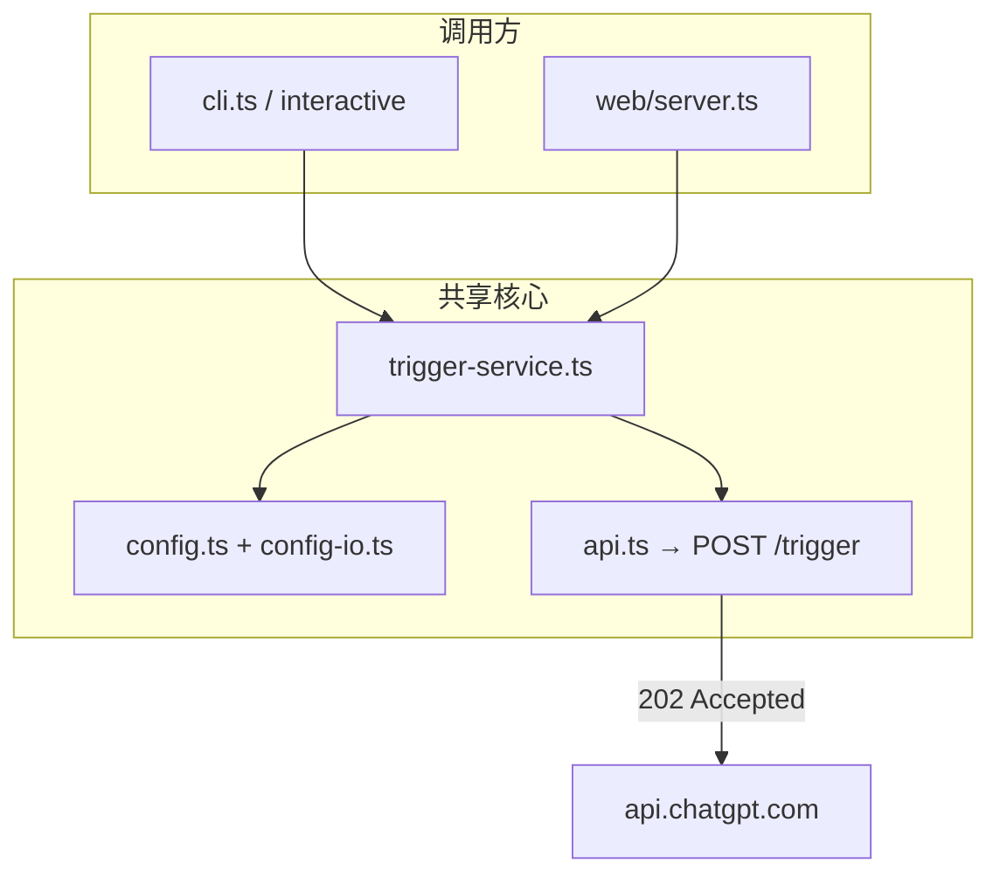

# [Review] v0.1 代码审查结论与待办

> **状态**：审查草稿（Cloud Agent 生成，可直接复制为 GitHub Issue）  
> **范围**：`master` @ `0b3a7f4` — TypeScript 单体 CLI + Web 双页 UI

---

## 总体评价

`gpt-agent-cli` 定位清晰：**Workspace Agents「触发入队」薄封装**，不做对话托管、不假装能拉取回复。架构分层合理，README 里的产品/架构说明已经写得很完整。

**做得好的地方：**

| 维度 | 说明 |
| --- | --- |
| 分层 | `trigger-service` / `config-io` 被 CLI、交互菜单、Web 共用，避免双轨逻辑 |
| API 边界 | `api.ts` 只认 202，错误码 hint 与官方文档对齐 |
| UX 骨架 | 无参进菜单、`agent` 子命令对标 `mpt channel`，学习成本低 |
| 安全 | Token 只走环境变量；Web 绑定 `127.0.0.1` |
| 可测性 | `mock-server.ts` + `agents.mock.yaml` 可离线验证 202/4xx |
| batch 语义 | `conversation_key` / `Idempotency-Key` 按 agent 后缀拆分，设计周到 |

**当前成熟度**：适合内部/小团队「配 agent → 试触发 → 脚本化 batch」；离「可公开发布 npm 包」还差 CI、测试自动化、配置一致性 polish。

---

## 发现的问题（建议开子 Issue 或 PR）

### P1 — 逻辑重复，CLI `batch` 未复用 `runBatchTrigger`

- `src/cli.ts` 的 `batch` 子命令内联了整套循环逻辑
- `src/interactive/index.ts` 已正确调用 `runBatchTrigger`
- `resolveIdempotencyKey` 在 `cli.ts` 与 `trigger-service.ts` 各有一份

**建议**：`batch` 改为调用 `runBatchTrigger`；`cli.ts` 从 `trigger-service` import `resolveIdempotencyKey`（或只保留一处 export）。

### P1 — 配置路径语义不一致

| 来源 | 路径 |
| --- | --- |
| README / `getConfigPath()` | `~/.gpt-agent/config.yaml` |
| `gpt-agent init` 输出 | `~/.config/gpt-agent/agents.yaml` |
| `CONFIG_CANDIDATES` | 还包含 `~/.config/gpt-agent/agents.yaml`、项目 `agents.yaml` 等 |

首次用户容易困惑「到底写哪个文件」。`agent add` 通过 `getConfigPath()` 写入 `~/.gpt-agent/config.yaml`，但 `findConfigPath()` 可能先命中项目目录下的 `agents.yaml`。

**建议**：

1. 统一文档与 `init` 输出为 **单一 canonical 路径**（推荐保留 `~/.gpt-agent/config.yaml`，与 mpt 的 `~/.mpt` 一致）
2. 明确优先级并在 `doctor` / 菜单 Banner 打印「当前生效配置路径」
3. `saveConfig` 在无 explicit path 时，优先写回「当前 load 到的 path」而非 `defaultConfigWritePath()`（cwd 的 `agents.yaml`）

### P2 — Web `/api/trigger` 错误码一律 500

`web/server.ts` 捕获 `TriggerApiError` 后统一返回 HTTP 500，前端无法区分 401/404/429。

**建议**：若 `e instanceof TriggerApiError`，返回 `e.status` + `{ error, agentName, agentId }`。

### P2 — Web agent 列表未过滤 `enabled: false`

交互菜单 / batch 用 `getEnabledAgentNames()` 过滤；`agent.js` 的 `loadAgents()` 展示全部 agent。

**建议**：Web 触发页只列 enabled agent，或在 UI 标注禁用状态。

### P2 — `agent-cmd` 写配置路径与读路径可能分叉

`loadWritable()` 总是 `resolveConfigPath(explicit ?? getConfigPath())`，不沿用 `loadConfig()` 实际命中的 `agents.yaml`。

**场景**：用户在项目根有 `agents.yaml`，但 `agent add` 会写到 `~/.gpt-agent/config.yaml`。

**建议**：`loadConfig` 返回的 `path` 作为写回默认目标。

### P3 — 小瑕疵

- `cli.ts` `init` 注释路径与 README 不一致
- Web `JSON.parse` 无 try/catch，恶意/错误 body 会 500
- `agent-cmd.ts` 的 `agentAdd` options 含未使用的 `model?` 字段
- 无 `agent edit` / `agent set-default` 子命令（Web setup 可能已覆盖部分能力，CLI 不对称）

---

## 架构图（审查确认与 README 一致）

---

## 建议验收标准（本 Issue 关闭条件）

- [ ] `batch` CLI 与 interactive 共用 `runBatchTrigger`
- [ ] 配置读写路径文档 + 代码行为一致
- [ ] Web trigger 错误返回真实 HTTP 状态码
- [ ] Web 触发页与 CLI 对 `enabled` 行为一致
- [ ] （可选）`npm run test:mock` 纳入 CI，mock server 由 test script 自动起停

---

## 参考文件

- `src/cli.ts` — batch 重复逻辑
- `src/trigger-service.ts` — 应被 CLI 复用
- `src/config.ts` / `src/config-io.ts` — 路径优先级
- `src/web/server.ts` — API 错误映射
- `src/web/public/agent.js` — enabled 过滤
